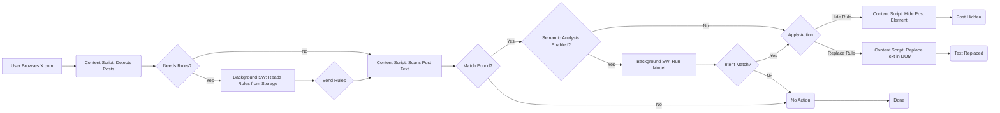
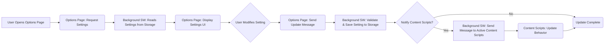

# Architecture: Agenda Revealer Chrome Extension

This document outlines the high-level architecture for the Agenda Revealer Chrome Extension.

## 1. Components Overview

The extension will consist of the following key components built using Manifest V3 standards:

1.  **Content Script (`content-script.ts`):**
    *   Runs in the context of `x.com` pages.
    *   Responsible for identifying post/tweet elements in the DOM.
    *   Scans the text content of posts.
    *   Communicates with the Background Service Worker to fetch rules and request actions (replace/hide/analyze).
    *   Performs DOM manipulation to replace text or hide elements based on instructions from the background script.
    *   Injects UI elements for manual data submission if configured.

2.  **Background Service Worker (`background.ts`):**
    *   Runs independently in the background.
    *   Manages the extension's state, including user settings and rules fetched from `chrome.storage`.
    *   Listens for messages from the Content Script and Options Page.
    *   Contains the core logic for matching text against rules (literal and semantic).
    *   Loads and runs the local semantic analysis model (e.g., using TensorFlow.js or ONNX Runtime Web) if enabled.
    *   Handles communication with the external backend API for data submission (if enabled).
    *   Manages listeners for browser events (e.g., tab updates) if needed.

3.  **Options Page (`options/` directory):**
    *   A standalone HTML page (`options.html`) with associated TypeScript/JavaScript (`options.ts`) and CSS (`options.css`).
    *   Built using standard Web APIs (HTML, CSS, Vanilla TypeScript/JavaScript).
    *   Provides the UI for users to configure settings (rules, analysis, hiding, submission, viewing local stats).
    *   Communicates with the Background Service Worker via `chrome.runtime` messaging to load and save settings/rules and fetch local analytics data.
    *   Uses standard DOM manipulation and event handling for UI updates and interactions.

4.  **Local Semantic Model:**
    *   A pre-trained machine learning model suitable for text classification or intent recognition (e.g., a distilled BERT model, TF Lite model).
    *   Packaged within the extension.
    *   Loaded and executed by the Background Service Worker using a suitable JavaScript library (TF.js, ONNX Runtime Web).

5.  **Storage (`chrome.storage.sync` or `chrome.storage.local`):**
    *   Used to persist user settings and rules.
    *   `chrome.storage.sync` is preferred for syncing settings across user's logged-in browsers, but has stricter size limits.
    *   `chrome.storage.local` offers more space but doesn't sync.

6.  **External Backend API (Conceptual):**
    *   A separate web service (details TBD, potentially a Loco.rs application) responsible for receiving submitted data.
    *   Provides an endpoint (e.g., `/api/submit`) for the extension's Background Service Worker to POST data to.
    *   Handles data storage, aggregation, and analytics.

## 2. Technology Stack

*   **Extension Framework:** Chrome Manifest V3
*   **Core Logic:** TypeScript
*   **Options Page UI:** HTML, CSS, Vanilla TypeScript/JavaScript
*   **UI Components/Styling:** Standard CSS (Potentially simple framework like Pico.css or basic custom styles)
*   **Build Tool:** Vite (configured for library/extension mode)
*   **Package Manager:** bun
*   **Local ML Execution:** TensorFlow.js or ONNX Runtime Web
*   **Backend (Conceptual):** Rust (Loco.rs framework), SeaORM, PostgreSQL/SQLite

## 3. Data Flow Diagrams

### 3.1 Content Modification Flow



### 3.2 Settings Management Flow



### 3.3 Data Submission Flow (Optional)

```mermaid
graph LR
    subgraph Extension
        A{Action Triggered (Replace/Hide Post)};
        A --> B{Submission Enabled?};
        B -- Yes --> C{Mode?};
        C -- Auto --> D[Background SW: Prepare Data];
        C -- Manual --> E[Content Script: Show Submit Button];
        E --> F{User Clicks Submit};
        F --> G[Content Script: Request Submission];
        G --> D;
        D --> H[Background SW: Send Data to API];
    end
    subgraph External Backend
        I(Backend API Endpoint /api/submit);
        H --> I;
        I --> J[Database: Store Data];
    end
    B -- No --> K(No Submission);
```

## 4. Key Considerations

*   **DOM Structure Changes:** X.com frequently updates its UI. The Content Script needs robust and adaptable selectors to identify posts reliably. Using `MutationObserver` might be necessary to handle dynamically loaded content.
*   **Performance:** DOM manipulation and text scanning can be resource-intensive. Optimize algorithms and consider debouncing or throttling operations, especially on infinite scroll feeds.
*   **Model Size & Performance:** The local semantic model must be small enough to be packaged with the extension and fast enough not to significantly degrade the user experience. Model quantization and efficient runtimes are crucial.
*   **Security & Privacy:** Clearly define the data submitted to the backend. Ensure secure transmission (HTTPS) and consider data minimization and anonymization.
*   **Error Handling:** Implement robust error handling for DOM manipulation, API calls, and model execution. 